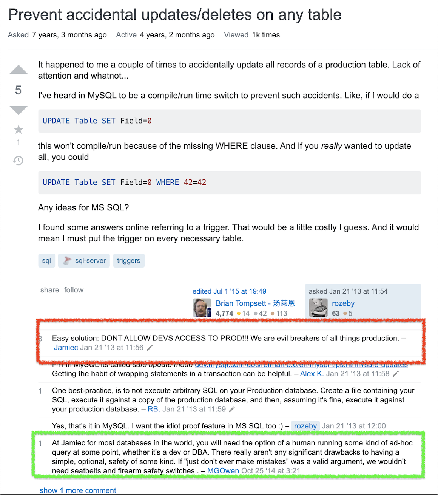
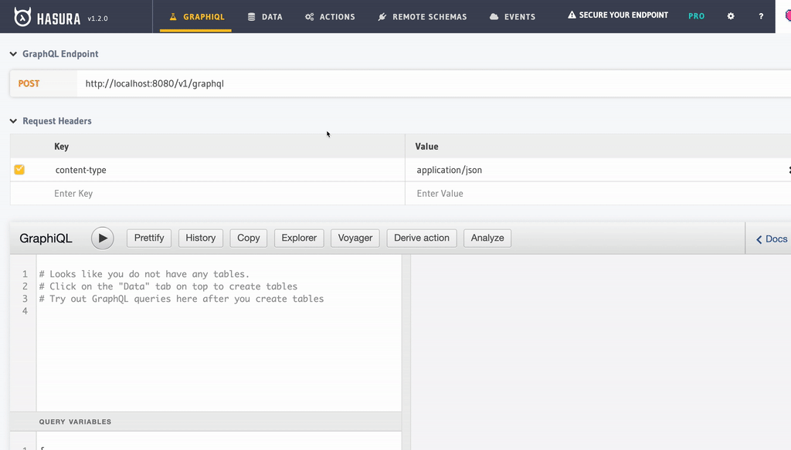
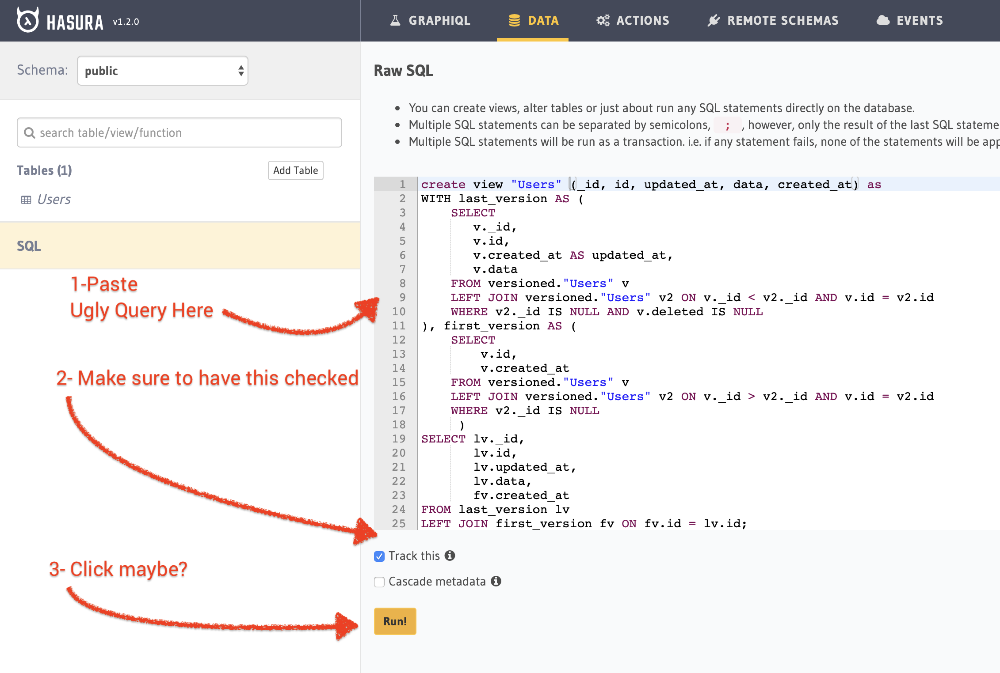
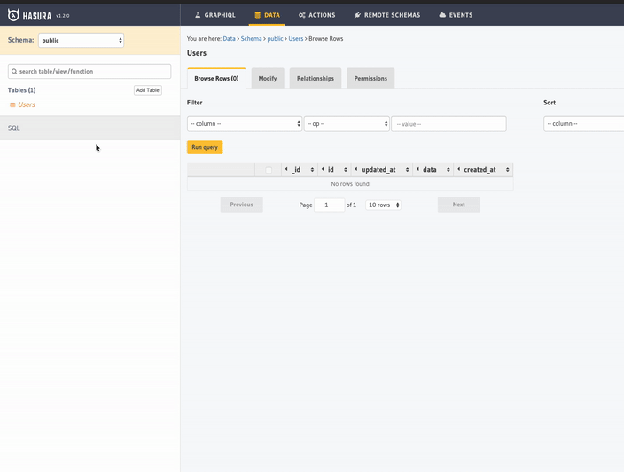

#  Version Your Data and Serve It via Real-time API

This is going to be a bit long but I think it really matters that you understand where my intentions are coming from.


## Problem

Have you ever lost critical data due to overwrite? Such a silly question... of course you have. This is the nasty side effect of the **U** in **CRUD**. It is not even a design flaw since an update operation is meant to replace you existing data. Hence, it is a very valid common use case.

Most common attempts to mitigate said problem might be limiting. A naive but brave suggestion suggests not to allow access to the DB.

    Problem: Prevent accidental updates/deletes on any table

    Easy solution: DON'T ALLOW DEVS ACCESS TO PROD!!! We are evil breakers of all things production.


source: https://stackoverflow.com/questions/14438055/prevent-accidental-updates-deletes-on-any-table

You read it right, `it is easy peasy, just don't do it bro!`. Probably, you received such advice as well. Let our hero, `MGOwen` speak for all of us: `If "just don't ever make mistakes" was a valid argument, we wouldn't need seatbelts and firearm safety switches`.

## Premise

What if preventing update is not an option? Let's think even more extreme and embrace updating sensitive data everywhere including in production. Imagine that your system requires applications to perform an update but still need to keep track of every goddamn change ever happened to data.

Welcome to my world, ladies, gentlemen and other gender members. I spent most of my career dealing with fintechs and finance companies in general. There is one capability you **must have** as a financial service provider. ***Every action must be logged alongside with corresponding data. Otherwise, you are liable for any financial crime occuring at your platform.*** This is the way of fintech life, you have to suck it up. 

*"So what? It is not rocket science"*, I hear you say and you are right. I mean, let me be honest, I have found many different ways to mitigate this problem in the past. There are myriad of ways to implement a platform with a versioned data model. That is not the point. The cost (both time and money) that such implementations often come attached with give start-ups a big smack in the face especially when they have to be agile. You see your friends enjoying building shiny new APIs backed by simple CRUD systems and start their start-up journey months ahead while you fight with tons of quirky data models to offer a brand new finance app to the world while regulators are stalking you. 


## Search for a safe heaven with my buddy Postgres

Back in the days, I semi-successfully co-founded a Business Intelligence SaaS company. There, my obsession was the inner workings of databases and I kept that obsession to this day. Out of all aspects of DBs, I was mostly interested in how they treat SQL. I love any database that has first class SQL support. When my friends were trying to shame me due to my loyalty towards SQL and skepticism towards new age NoSQL conventions, I was throwing back at them my buddy Postgres. Its use of SQL and modular architecture with a rock solid stability(and of course, performance) was keeping NoSQL fanboys at bay. But they were still shouting outside. 

**"Good luck with wasted resources on developing cool APIs on top of your DB from the 90s"**

I saw people developing kickass applications with extreme interactivity using Firebase, RethinkDB and co, served behind a shiny cool GraphQL API, consumed by even shinier patterns like Redux. These guys were cool guys. To be fair, they looked cool too. It was not just a gimmick. I was dreaming to have a company where I could build a kick ass finance product with such tech stack. In the last fintech company I co-founded, it was my stage to show the world that I can also tackle those challenges with Postgres and without hiring half of the developers in Berlin. Well, *NOPE* it did not happen. Even though we used GraphQL, providing a reactive API aka **Subcriptions** backed by a traditional Database (***with versioned data structures***) is really harder than I imagined.

 I almost gave up and even cheated my beloved Postgres with Firebase. I'm not going to comment on that experience much but here is what I get to say about it: *"It ended up being a huge disapointment and regret"*. It is a beast that can't perform a basic [logical `OR` operation](https://stackoverflow.com/questions/46726673/firebase-firestore-or-query) in 2020. let that sink in ...

I was desperate ...

##  A Hero that I have not ask for...

GraphQL **Subscriptions** defined my search criteria. After a lot of struggle, I started to look for a solution that provides real-time interactivity on top of **my very own data model** with minimal effort. Remember, I want to have all the bells and whistles of the reactive world without sacrificing a custom data model that provides built in versioning. I know I ask for a lot but I'm a dreamer. 

First, my friends pointed me towards another Berlin based start-up called graph.cool and their baby product called **Prisma**. It was a very compelling product. It almost got me using it. At that time(early 2019), their support for subscriptions when data is nested, was tricky. Besides all, I did not support my data layer it is not built by them. You can imagine that my old buddy Postgres can do wonders in terms of how flexible you can model your data layer. Prisma was having none of it.

Then I saw Hasura. It was too good to be true. They were claiming that any possible query you can come up with can also be a subscription. Moreover, *this is where they got me in*, Hasura supported your very own data model. As if this is not enough, they had very promising permissin system where I could build a role-based access control model using JSON Web Tokens (This aspect is another killer feature alone but I'm not going to talk about it today, here are some nice sources that inspired me though [1](https://dev.to/lineup-ninja/modelling-teams-and-user-security-with-hasura-204i)[, 2)](https://hasura.io/blog/access-control-patterns-with-hasura-graphql-engine/). All of these features can be done with minimal or zero coding.

So I wanted to give it a try. 

##  A glimpse into my joy

I will be way quicker with this one. I want to, *very quickly and simply*, show you that what I am capable of doing with this bad boy. You can do way more than what I am about to show you but for the sake of keeping it quick and simple, here we go...

Imagine a GraphQL API that:

- versions any change you can do to a database table
- lets you see all historical versions alongside with the current version
- let's you recover data even if you delete it
- offers a direct GraphQL API with impressive (IMHO, best in class) query capabilities
- is realtime
- works only with Hasura and SQL (plus, of course, docker duh).

#### 0 - Start Hasura and Postgres
run these commands and go to http://localhost:8080 in your browser.

```
 $ wget https://raw.githubusercontent.com/hasura/graphql-engine/stable/install-manifests/docker-compose/docker-compose.yaml
 $ docker-compose up -d
```

For docker questions follow this [link](https://hasura.io/docs/1.0/graphql/manual/getting-started/docker-simple.html)

#### 1 - Meet our _versioned_ table: Users

Here are the features of this table that are crucial to me (regardless of actual content):

- User table has `id` (uuid) and `_id` (int) as identifiers. `_id` specificly holds version indentifier within objects with the same `id`. `id` is generated by default using `gen_random_uuid()` and `_id` has auto increment `nextval('schema."<table><column>_seq"'::regclass)`
- User lives under a schema called `versioned`



- User has a `created_at` (timestampz) field that has `now()`(current time) as default value.
- A boolean `deleted` field is added to mark record deletion.
- A `data` (jsonb) field is added to represent the versioned content. There is no limit(except DB column limit) for how many columns you can add to the table. We don't care. All of these fields will be versioned. 

Here is a gif for you. Hasura Console is enough to create this table without any direct access to our beloved DB.


Final table has following DDL:
```
create table "Users"
(
    id          uuid default gen_random_uuid()                    not null,
   _id          serial                                            not null
                constraint "Users_pkey"
                primary key,
    created_at timestamp with time zone default now()             not null,
    data       jsonb                                              not null,
    deleted    boolean
);
```

#### 2 - Meet our view: Users

This part is the most tricky part of all. We need to create a `SQL View` to represent the most current version of the user record sharing the same `id` value. Additionally, we need to access the `created_at` value of our very first version of a user with the same `id`. If the *most recent* record has `deleted` with `true` as value, then we need to hide it so it doesnt appear in this layer.

Bear with me and take a look at this ugly query.

```
CREATE VIEW "Users"(_id, id, updated_at, data, created_at) as
WITH last_version AS (
    SELECT
       v._id,
       v.id,
       v.created_at AS updated_at,
       v.data
    FROM versioned."Users" v
    LEFT JOIN versioned."Users" v2 ON v._id < v2._id AND v.id = v2.id
    WHERE v2._id IS NULL AND v.deleted IS NULL
), first_version AS (
    SELECT
        v.id,
        v.created_at
    FROM versioned."Users" v
    LEFT JOIN versioned."Users" v2 ON v._id > v2._id AND v.id = v2.id
    WHERE v2._id IS NULL
     )
SELECT lv._id,
       lv.id,
       lv.updated_at,
       lv.data,
       fv.created_at
FROM last_version lv
LEFT JOIN first_version fv ON fv.id = lv.id;
```

Lets break this down:
- `last_version` and `first_version` hold first and last version of a record with same `id`
- with `...ON v._id < v2._id AND v.id = v2.id` we perform a self join with records with same `id` and greater`_id` (or smaller when `v._id > v2._id`). If particular record fails to join itself with given conditions, it implies that it is the latest record (or first one when ` v._id > v2._id`). Finally, we only select that edge record (first or last) with `WHERE v2._id IS NULL`
- `v.deleted IS NULL` eliminates the record with given `id`, if the last version is marked as deleted
- `last_version`'s `created_at` value is actually the last update date for a record. So we alias this part using `v.created_at AS updated_at,`
- finally, we combine first and last value with
```
SELECT lv._id,
       lv.id,
       lv.updated_at,
       lv.data,
       fv.created_at
FROM last_version lv
LEFT JOIN first_version fv ON fv.id = lv.id;
```

This is one of many ways of retrieving the first or last value within a group. In real life I use more eloborate but more performant ways of doing same job. I just wanted to showcase what I meant with a simple example.
Check out these links to get a better idea about these patterns ([1](https://thoughtbot.com/blog/ordering-within-a-sql-group-by-clause), [2](https://www.red-gate.com/simple-talk/sql/database-administration/sql-strategies-for-versioned-data/), [3](https://hakibenita.com/sql-group-by-first-last-value)).

And of course, don't forget to add it to Hasura:


#### 3 - Meet our relation: Versions

As promised, our approach will **_let you see all historical versions along side with the current version_**.

Hasura comes to our rescue:



Now we are able to reference each version of our record alongside with the most recent one.

## Conclusion

Consider Hasura as a SQL generator engine for your GraphQL API. It is a very powerful **single** layer for your application. Investigating the generated SQL query for a given operation is mostly enough to understand what is happening under the hood. This transparency is very rare to find for a product that provides such capabilities.

However, for high stake tasks, such as finance, utilizing a very trivial use of [actions](https://hasura.io/docs/1.0/graphql/manual/actions/index.html) to control and enhance the API layer can be quite crucial. 

With this approach, you are only **inserting new records** into your DB. We must take away any `UPDATE`, `DELETE`, `TRUNCATE` privilages from operating DB users. In addition to that, Hasura, must limit the access to the corresponding mutations using various techniques such as [Whitelisting](https://hasura.io/docs/1.0/graphql/manual/deployment/allow-list.html), [Authorization & Access Control](https://hasura.io/docs/1.0/graphql/manual/auth/authorization/index.html).

I have not touched such aspects within the scope of this tutorial. However, they are very powerful and useful abstraction mechanisms. 

That's it. We are done and can enjoy our new API. Here is a glimpse of the joyful use of the real-time versioned API we have just created without wasting sprints by a team of engineers.


