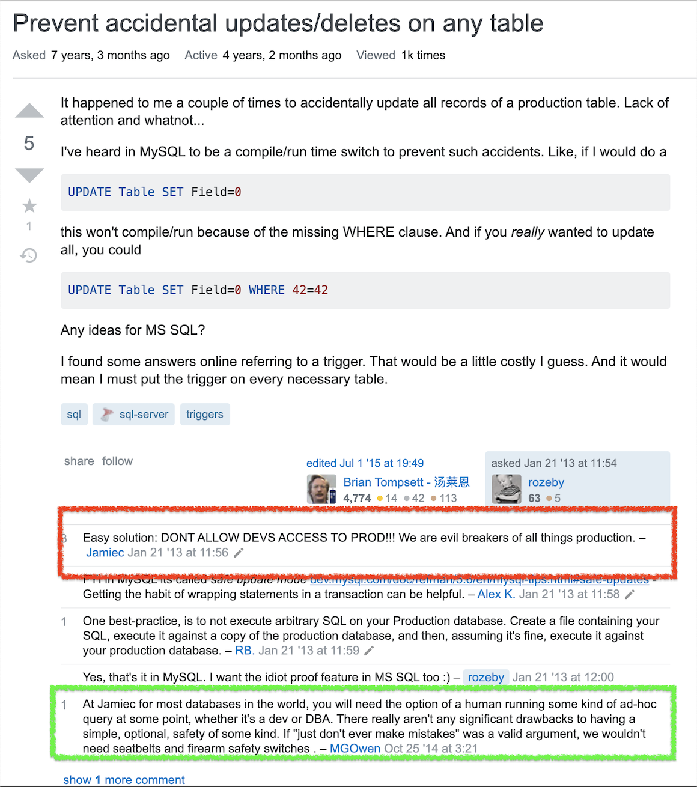
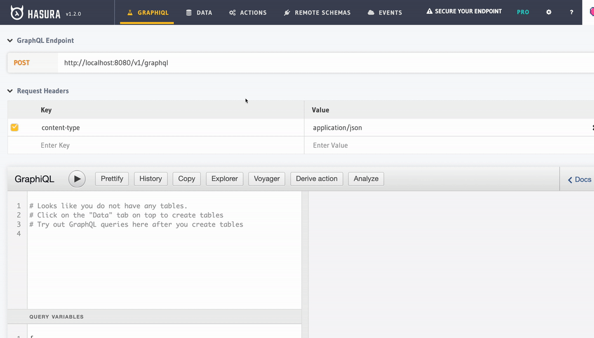
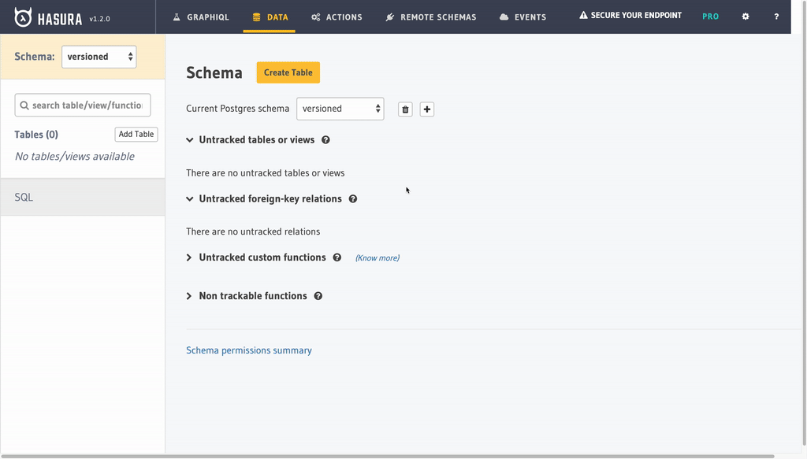
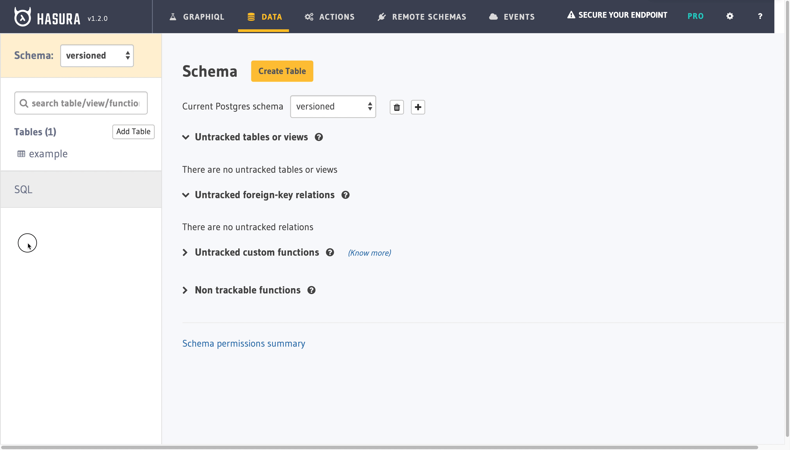
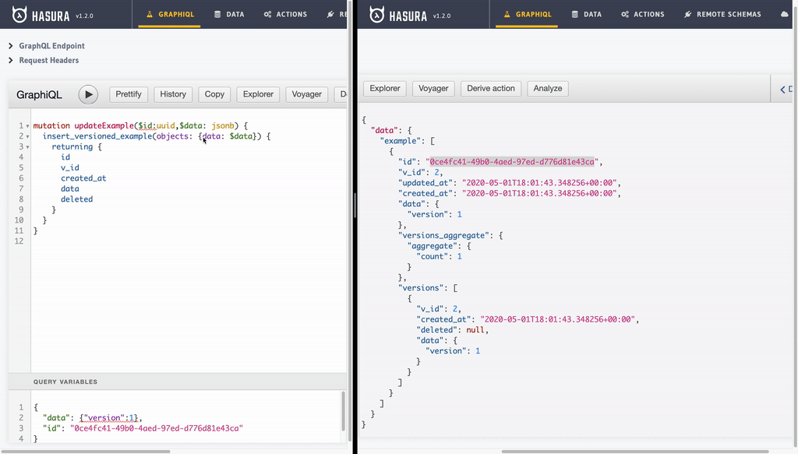
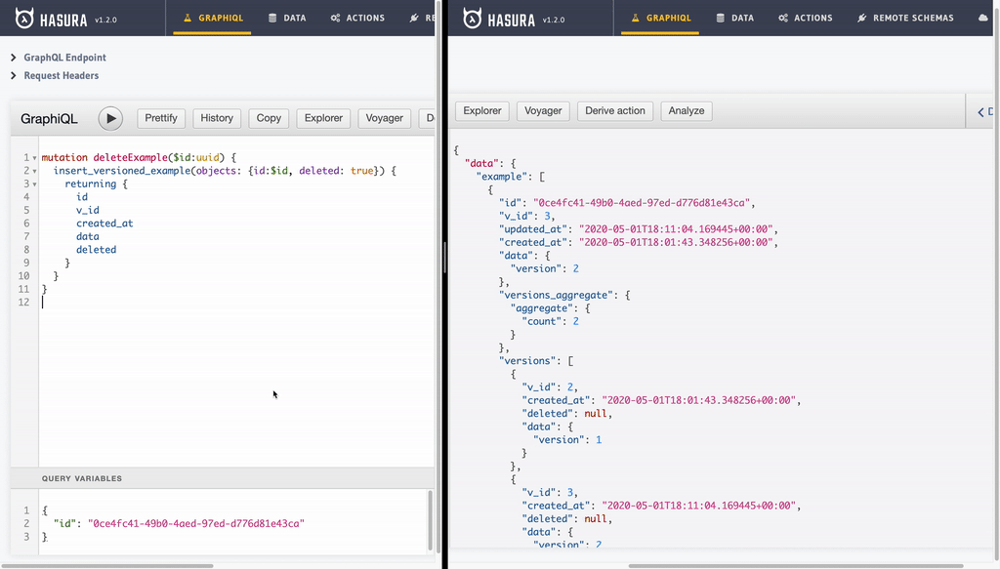
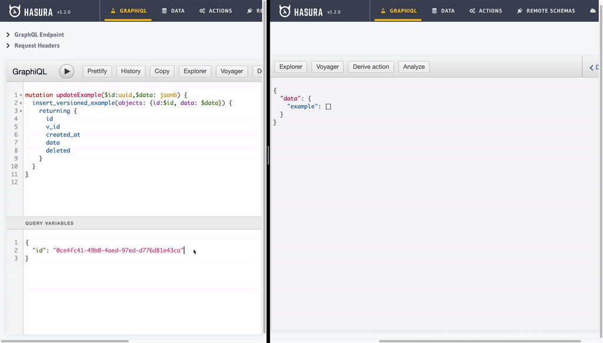
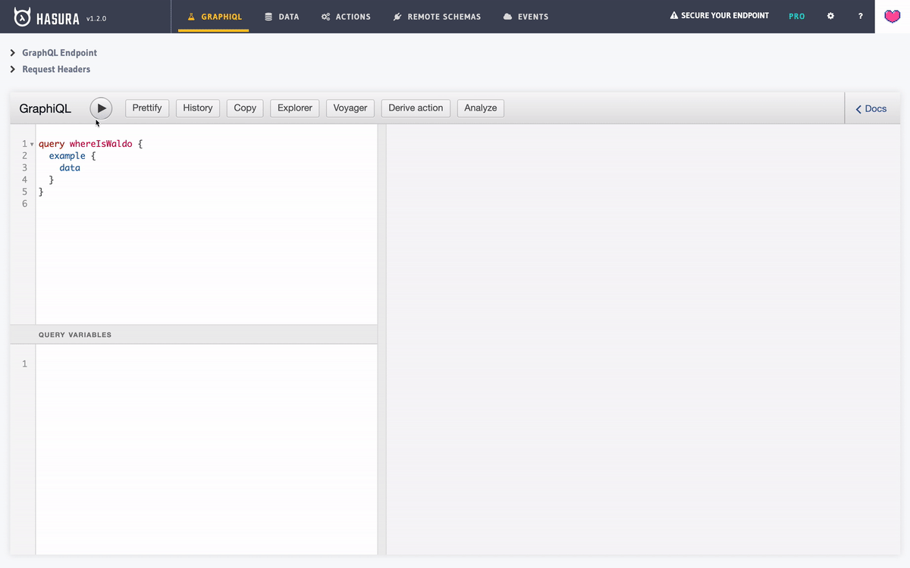
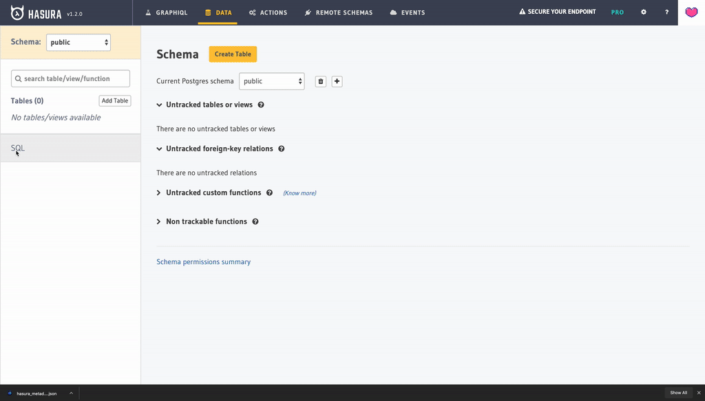
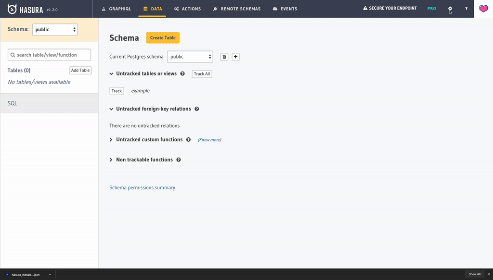

#  Version and Serve Your Data with Hasura

### ToC
  * [Problem](#problem)
  * [Premise](#premise)
  * [Solution](#Solution)
  * [Conclusion](#conclusion)


## Problem

Have you ever lost critical data due to overwrite? Such a silly question... of course you have. This is the nasty side effect of the **U** in **CRUD**. It is not even a design flaw since an update operation is meant to replace you existing data. Hence, it is a very valid common use case.

Most common attempts to mitigate said problem might be limiting. A naive but brave suggestion suggests not to allow access to the DB.

    Problem: Prevent accidental updates/deletes on any table

    Easy solution: DON'T ALLOW DEVS ACCESS TO PROD!!! We are evil breakers of all things production.


source: https://stackoverflow.com/questions/14438055/prevent-accidental-updates-deletes-on-any-table

You read it right, `it is easy peasy, just don't do it!`. It is not a super bad advice. Infact, you probably received such advice as well.  It might be useful for some, very limited, use cases. Anyways, let our hero, `MGOwen` speak for all of us: `If "just don't ever make mistakes" was a valid argument, we wouldn't need seatbelts and firearm safety switches`.

## Premise

What if preventing update is not an option? Let's think even more extreme and embrace updating sensitive data everywhere including in production. Imagine that your system requires applications to perform an update but still need to keep track of every goddamn change ever happened to data.

Welcome to my world, ladies, gentlemen and other gender members. I spent most of my career dealing with fintechs and finance companies in general. There is one capability you **must have** as a financial service provider. ***Every action must be logged alongside with corresponding data. Otherwise, you are liable for any financial crime occuring at your platform.*** This is the way of fintech life, you have to suck it up. 

"Versioning data? So what? It is not rocket science", I hear you say and you are right. I mean, let me be honest, I have found many different ways to mitigate this problem in the past. There are myriad of ways to implement a platform with a versioned data model. That is not the point. The cost (both time and money) that such implementations often come attached with give start-ups a big smack in the face especially when they have to be agile. You see your friends enjoying building shiny new APIs backed by simple CRUD systems and start their start-up journey months ahead while you fight with tons of quirky data models to offer a brand new finance app to the world while regulators are stalking you.

Hasura is a perfect tool to add API on top of such data models with ease.


##  Solution

I will be way quicker with this one. I want to, *very quickly*, show you that what I am capable of doing with this bad boy. You can do way more than what I promised in the begining of the post but I'm keeping it simple. We are going to build a GraphQL API that:

- Versions any change you can do to a database table
- Shows you all historical versions alongside with the current version
- Let's you recover data even if you delete it
- Offers a direct GraphQL API with impressive (IMHO, best in class) query capabilities
- Is real-time
- Implemented only with Hasura and Postgres (plus, of course, docker duh).

#### Preparation - Start Hasura and Postgres
Run these commands and go to http://localhost:8080 in your browser.

```
 $ wget https://raw.githubusercontent.com/hasura/graphql-engine/stable/install-manifests/docker-compose/docker-compose.yaml
 $ docker-compose up -d
```
Have questions? Not my problem. I'm here to tell my story. For Installation related questions follow this [link](https://hasura.io/docs/1.0/graphql/manual/getting-started/docker-simple.html)

#### STEP 1 - Meet our _versioned_ DB table: _example_
Here are features of this table that is crucial to me(regardless of actual content):

- Example table lives under a schema called `versioned`

- Example table has `id` (uuid) and `v_id` (int) as identifiers. `v_id` specificly holds version indentifier within objects with the same `id`. `id` is generated by default using `gen_random_uuid()` and `v_id` has auto increment `nextval('schema."<table><column>_seq"'::regclass)`


- Example table has a `created_at` (timestampz) field that has `now()`(current time) as default value.
- A boolean `deleted` field is added to mark record deletion.


A `data` (jsonb) field is added to represent the versioned content. There is no limit(except DB column limit) for how many columns you can add to the table. We don't care. All of these fields will be versioned. 

Here is a gif for you. Hasura Console is enough to create this table without any direct access to our beloved DB.



Final table has following DDL:
```sql
CREATE TABLE IF NOT EXISTS versioned.example
(
    id         UUID                     DEFAULT gen_random_uuid() NOT NULL,
    v_id       SERIAL                                             NOT NULL
               CONSTRAINT example_pkey
               PRIMARY KEY,
    created_at TIMESTAMP WITH TIME ZONE DEFAULT now()             NOT NULL ,
    data       JSONB,
    deleted    BOOLEAN
);
COMMENT ON TABLE versioned.example IS 'an example table';
```

#### STEP 2 - Meet our DB view: _example_	

This part is the most tricky part of all. We need to create a `SQL View` to represent the most current version of the example record sharing the same `id` value. Additionally, we need to access the `created_at` value of our very first version of a example record with the same `id`. If the *most recent* record has `deleted` with `true` as value, then we need to hide it so it doesnt appear in this layer.

Bear with me and take a look at this ugly query.

```sql
CREATE OR REPLACE VIEW public.example as
WITH last_version AS (
    SELECT
       v_e.v_id,
       v_e.id,
       v_e.created_at AS updated_at,
       v_e.data
    FROM versioned.example v_e
    LEFT JOIN versioned.example v_e2 ON v_e.v_id < v_e2.v_id AND v_e.id = v_e2.id
    WHERE v_e2.v_id IS NULL AND v_e.deleted IS NULL
), first_version AS (
    SELECT
        v_e.id,
        v_e.created_at
    FROM versioned.example v_e
    LEFT JOIN versioned.example v_e2 ON v_e.v_id > v_e2.v_id AND v_e.id = v_e2.id
    WHERE v_e2.v_id IS NULL
)
SELECT lv.id,
       lv.v_id,
       lv.updated_at,
       lv.data,
       fv.created_at
FROM last_version lv
LEFT JOIN first_version fv ON fv.id = lv.id;
COMMENT ON VIEW example is 'an example view:)';
```

Let's break this down:
- `last_version` and `first_version` hold first and last version of a record with same `id`
- with `...ON v_e.v_id < v_e2.v_id AND v_e.id = v_e2.id` we perform a self join with records with same `id` and greater`v_id` (or smaller when `v_e._id > v_e2.v_id`). If particular record fails to join itself with given conditions, it implies that it is the latest record (or first one when ` v_e.v_id > v_e2.v_id`). Finally, we only select that edge record (first or last) with `WHERE v_e2.v_id IS NULL`
- `v_e.deleted IS NULL` eliminates the record with given `id`, if the last version is marked as deleted
- `last_version`'s `created_at` value is actually the last update date for a record. So we alias this part using `v_e.created_at AS updated_at,`
- finally, we combine first and last value with
```
SELECT lv._id,
       lv.id,
       lv.updated_at,
       lv.data,
       fv.created_at
FROM last_version lv
LEFT JOIN first_version fv ON fv.id = lv.id;
```
This is one of many ways of retrieving `first/last value within group`. In real life I use more eloborate but more performant ways of doing same job. I just wanted to showcase what I meant with a simple example. Check out these links to get better idea about these patterns([1](https://thoughtbot.com/blog/ordering-within-a-sql-group-by-clause), [2](https://www.red-gate.com/simple-talk/sql/database-administration/sql-strategies-for-versioned-data/), [3](https://hakibenita.com/sql-group-by-first-last-value)). Internet is full of them.

Don't forget to add it to Hasura:


#### STEP 3 - Meet our relation: _versions_
As I promised, our approach will **_let you see all historical versions along side with current version_**.
We will connect `versioned.example` table with `public.example` view on `id` column. As each example record potentially has many versions, we need one to many, aka array,  relationship. _Hasura Relationships_ comes to our resque:


Now we are able to reference each version of our record alongside with most recent one.

#### STEP 4 - This is not the step you are looking for.
No more steps. We are done and let's enjoy our new API. Here is a glimpse of joyful use of real-time versioned API we have just created without wasted sprints by a team of engineers. I'm going to add/update/delete/undelete an example record using Hasura GraphiQL UI. In the meantime, all of my actions will be tracked in real-time using a GraphQL subscription query.

Let's have a look at our query:

```
// $id -> id of the record we are watching
subscription watchExample($id: uuid) { 
// we place our variable to filter example records in true SQL fashion 
    example(where: {id: {_eq: $id}}) { 
        id
        v_id
        updated_at
        created_at
        data
// Hasura Let's you run aggregate queries using GraphQL. 
// Here we are aggregating number of versions per each example record!
        versions_aggregate {
            aggregate {
                count(columns: v_id)
            }
        }
// We are also getting versions of each record.
        versions {
            v_id
            created_at
            deleted
            data
        }
    }
}

```

- **Adding record:** We will be adding record using `insert_versioned_example` mutation automatically created by Hasura. Note that, our schema naming convention comes handy here.


```
mutation addExample($data: jsonb) {
  insert_versioned_example(objects: {data: $data}) {
    returning {
      id
      v_id
      created_at
      data
      deleted
    }
  }
}

```


Note that as, initially, we have no example recods, our subscription query has no filter value. After first insert, we update our subscription query to watch one particular example record.


- **Updating record:** Update operation is another insert operation with an `id`. But thanks to the way our example view is setup, we only will see last record. 

```
mutation updateExample($id:uuid,$data: jsonb) {
  insert_versioned_example(objects: {id:$id, data: $data}) {
    returning {
      id
      v_id
      created_at
      data
      deleted
    }
  }
}
```




- **Deleting record:** Delete operation is also an insert operation with an `id` and `deleted`(with value set to `true`). 

```
mutation deleteExample($id:uuid) {
  insert_versioned_example(objects: {id:$id, deleted: true}) {
    returning {
      id
      v_id
      created_at
      data
      deleted
    }
  }
}
```




- **Undelete/Recover record:** This just another update operation. As value of `delete` column is not set to `true` for last version of a particular example record, we will see it back with all recious versions retained!


```
mutation updateExample($id:uuid,$data: jsonb) {
  insert_versioned_example(objects: {id:$id, data: $data}) {
    returning {
      id
      v_id
      created_at
      data
      deleted
    }
  }
}
```





- **BONUS:** Let's query our table across all versions.



Pretty neat isn't it?

## Conclusion
Consider Hasura as a SQL generator engine for your GraphQL API.
It is a very powerful **single** layer for your application.
Investigating generated SQL queries for given operation is mostly enough to understand what is happening under the hood.
This transparency is very rare to find for a product that provides such capabilities.
However, for high stake tasks, such as finance, utilizing a very trivial use of [actions](https://hasura.io/docs/1.0/graphql/manual/actions/index.html) to control and enhance your API layer can be crucial. 

With this approach, you are only **inserting new records** to your DB.
We must take away any `UPDATE`, `DELETE`, `TRUNCATE` privilages from the operating DB user.
In addition to that, Hasura must limit the access to corresponding mutations using various techniques such as [Whitelisting](https://hasura.io/docs/1.0/graphql/manual/deployment/allow-list.html),
[Authorization & Access Control](https://hasura.io/docs/1.0/graphql/manual/auth/authorization/index.html).
I haven't touched such aspects within the scope of this tutorial.
However, they are very powerful and useful abstraction mechanisms. 

###### PS: if you are a TLDR kind of person, you can check out my repo and replicate this tutorial easily. First execute the contents of `db_schema_dump.sql` and load the metadata using `hasura_metadata.json`




